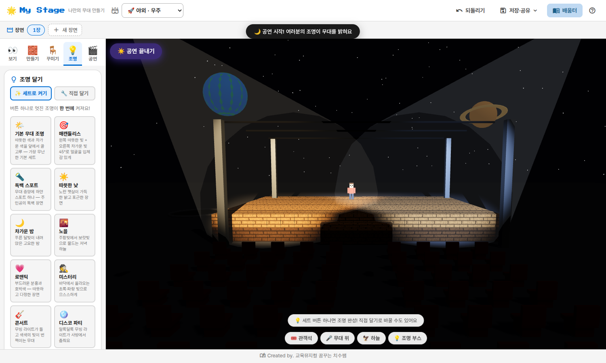
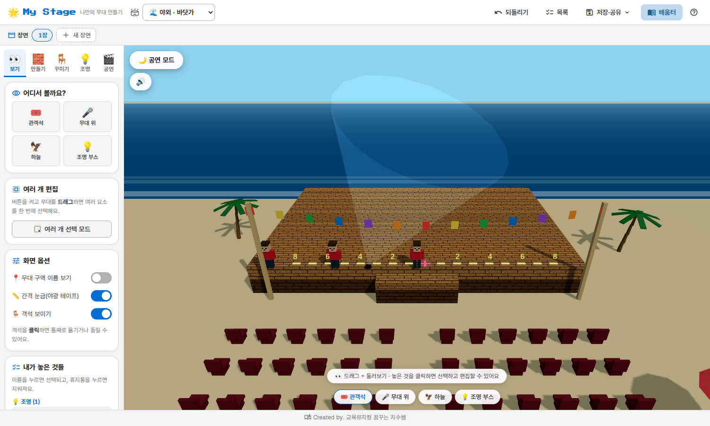
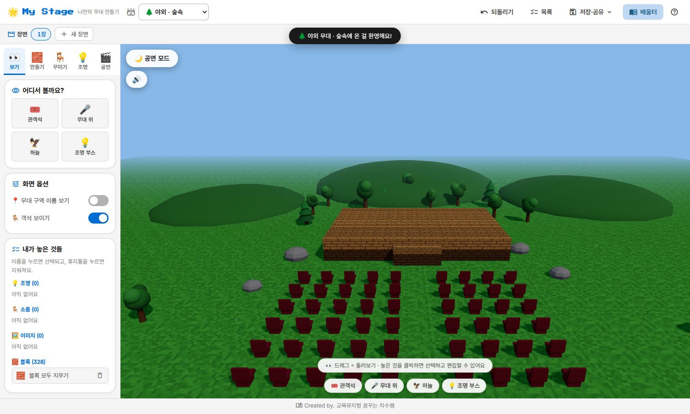
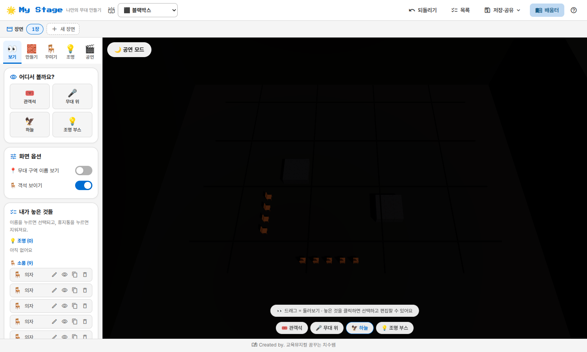
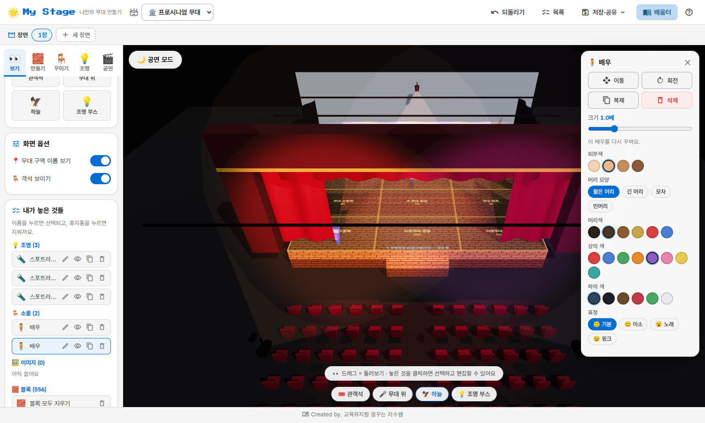
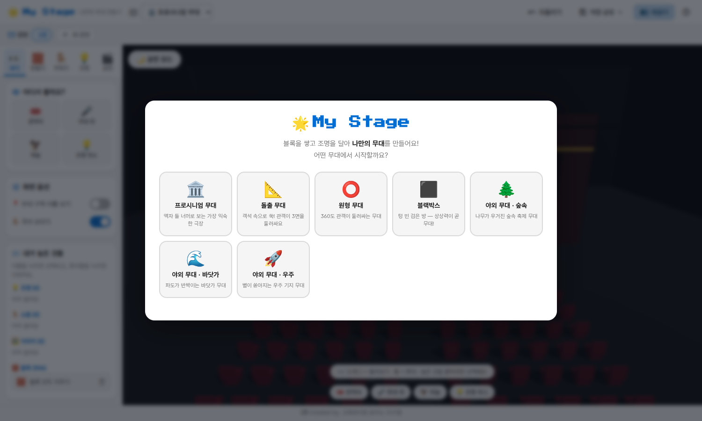

# 🌟 My Stage — 나만의 무대 만들기

어린이·청소년·선생님을 위한 **3D 무대 디자인 웹앱**입니다.
마인크래프트처럼 블록을 쌓고, 진짜 극장처럼 조명을 달아 누구나 나만의 무대를 상상하고 만들어 볼 수 있어요.

**▶ 바로 사용하기: https://chichiboo123.github.io/mystage/**


## 🧭 이렇게 사용해요 (3단계)

처음 열면 무대를 고르고, 3단계 안내가 나와요. 왼쪽 도구 탭도 같은 순서예요.

| 단계 | 탭 | 하는 일 |
|---|---|---|
| 1️⃣ 만들기 | 🧱 | 블록을 골라 무대를 클릭! 쌓아서 무대를 만들어요 (반블록·지우개 🧽 포함) |
| 2️⃣ 꾸미기 & 조명 | 🪑 💡 | 배우·소품을 놓고, **조명 세트 버튼 하나**로 멋진 조명을 켜요 |
| 3️⃣ 공연하기 | 🎬 | 큐와 음악을 준비하고 **🌙 공연 모드**를 누르면 극장이 어두워지고 내 조명만 반짝! |

- 놓은 것을 **한 번 더 클릭하면 삭제**돼요. (오른쪽 클릭, Delete 키, 목록의 휴지통도 OK)
- **되돌리기**(Ctrl+Z)는 언제나 든든한 친구!
- 사용법은 상단 **❓** 버튼으로 언제든 다시 볼 수 있어요.

## ✨ 주요 기능

### 🏛️ 무대 형태별 정확한 구조 (극장 이론 기반)
각 무대는 실제 극장 이론의 특징을 그대로 담았어요.

| 무대 | 구조 |
|---|---|
| 🏛️ 프로시니엄 | 프로시니엄 아치, 한쪽 객석, 윙(옆무대), 막, 배튼, 배경막(사이클로라마)을 갖춘 액자형 무대 |
| 📐 돌출 무대 | 무대가 객석 안으로 돌출, 관객이 앞·좌·우 3면에서 관람. 시야를 위해 배경은 낮게 |
| ⭕ 사방 객석 무대 | 관객이 360도로 둘러싸고 통로(보메토리)로 등장. 배경막 없이 천장 조명 그리드 중심 — 바닥이 꼭 원형일 필요는 없다는 것도 배움터에서 설명해요 |
| ⬛ 블랙박스 | 완성된 무대가 아니라 검은 빈 공간 + 조명 그리드 + 이동식 플랫폼·객석. 배치를 마음대로 실험하는 가변형 공간 |
| 🌲 숲속 | 지붕 없는 숲속 빈터 무대 — 나무 숲, 바위, 언덕, 반딧불이, 은은한 안개 |
| 🌊 바닷가 | 만국기가 펄럭이는 해변 축제무대 — 모래사장, 밀려오는 파도 거품, 야자수, 파라솔 |
| 🚀 우주 | 원형 금속 착륙패드 무대 — 달 크레이터, 돔 거주구·모듈·안테나 기지, 지구와 토성 |

| 우주 기지 무대 | 바닷가 축제무대 |
|---|---|
|  |  |

| 숲속 공연장 | 블랙박스 (가변형 공간) |
|---|---|
|  |  |

### 🎵 환경 소리 (BGM)
숲·바다·우주 무대에 들어가면 어울리는 배경 소리가 자동으로 무한 반복 재생돼요. 음량 조절·음소거 가능, 장면을 바꿔도 음악이 끊기지 않고, 다른 환경으로 바꾸면 그 환경의 소리로 전환돼요.

### 🧱 마인크래프트식 블록 빌딩
픽셀 텍스처 블록 22종(나무·커튼·벽돌·유리·발광 LED·무지개 색), 반블록, **지우개 도구**(터치 기기에서도 삭제 가능), 초록/빨강 미리보기 고스트.

### 🪑 소품 & 배우 — 주제별 6묶음, 50여 종
인물(배우·왕·유령…) · 가구 · 악기 · 자연 · 무대장치 · 물건.
**🧍 배우 꾸미기**: 피부색·머리 모양·머리색·상의/하의 색·표정을 색상칩으로 골라 나만의 배우를 만들어요 (실시간 미리보기, 랜덤 버튼).
**🖼️ 내 이미지**: 그림·사진을 올리면 무대 위 2D 입간판으로 세워져요 (크기·회전 조절).

### ✏️ 놓은 것 다시 편집
놓은 블록·배우·소품·이미지·조명을 클릭하면 **편집 패널**이 열려요 — 요소 종류에 맞는 기능만 보여줘요.
- 이동(옮길 곳 클릭) · 회전 · 크기 · 복제 · 삭제
- 블록은 다른 블록으로 색(종류) 바꾸기, 배우는 다시 꾸미기, 조명은 색·밝기·각도·겨누기
- 모든 변경은 **되돌리기(Ctrl+Z)** 지원

### 📋 요소 목록 (사이드바 + 플로팅)
'보기' 탭의 목록 외에도 상단 **목록** 버튼으로 화면 오른쪽에 플로팅 패널을 띄울 수 있어요 (열기/접기/닫기). 목록에서 선택·이름 바꾸기·숨기기·복제·삭제가 가능하고 3D 화면의 선택과 연동돼요.



### 💡 조명 — 초보자도 버튼 하나로
- **조명 세트 16종 (토글)**: 매캔들리스, 독백 스포트, 노을, 콘서트, 디스코, 무지개… 한 번 누르면 켜지고, 같은 버튼을 다시 누르면 꺼져요. 다른 세트를 누르면 교체되고, 직접 단 조명은 그대로 유지돼요
- **직접 달기**: 스포트라이트·팔로우 스팟·워시·플로어·무빙 라이트 5종 — 실제 광원과 그림자, 빛줄기 표현
- 컬러 젤 8색 + 자유 색, 밝기·빔 각도 조절, 하우스 라이트 디머

### 🎬 공연 만들기
- **장면(場)**: 장면마다 블록·조명·소품을 따로 꾸미고 탭으로 전환
- **조명 큐**: 지금 조명을 큐로 저장 → 클릭 한 번에 부드러운 페이드 전환, 순서대로 자동 재생
- **음악**: 오디오 파일 업로드 또는 유튜브 링크(공식 임베드 플레이어)
- **🌙 공연 모드**: 하우스 라이트를 끄고 내 조명만으로 무대 감상

### 📍 무대 방향과 9구역 — 배우 기준으로 정확하게
- 무대의 왼쪽/오른쪽은 **객석을 바라보는 배우 기준**으로 통일: 무대 오른쪽(SR)·무대 왼쪽(SL)
- 9구역 오버레이: 윗무대(US)/아랫무대(DS) × 오른쪽/중앙/왼쪽 = USR·USC·USL / SR·CS·SL / DSR·DSC·DSL — 관객 시점 화면에서 SR 구역이 왼쪽에 보여요
- 사방 객석·블랙박스처럼 정면이 없는 공간은 앱의 **기준 정면**을 오버레이에 함께 안내
- 상수/하수는 전통 현장 용어로 배움터에서 소개 (SR=하수, SL=상수)

### 📚 무대 배움터 (출처 기반)
국립극장 『무대예술용어집』, Theatres Trust 극장 유형 자료, 미국 무대기술 표준 교재(Gillette) 등 공신력 있는 자료를 참고해 작성했고, 각 항목에 **참고 자료**를 표기했어요.
- 프로시니엄·돌출·사방 객석·블랙박스의 차이 (블랙박스 = 가변형 공연 공간!)
- Stage Right/Left(배우 기준)와 House Right/Left(관객 기준)
- 업스테이지/다운스테이지가 경사 무대에서 유래한 이야기
- 조명 이론(가산혼합·매캔들리스·큐), 용어 사전, 교실 활동 미션 카드

### 💾 저장과 공유
브라우저 자동 저장 + 이어서 만들기, JSON 내보내기/불러오기, 📸 스크린샷 — 상단 **저장·공유** 메뉴에 모여 있어요.

## 🖼️ 시작 화면과 작업 화면

| 무대 고르기 | 작업 화면 |
|---|---|
|  |  |

## 🚀 직접 실행하기

정적 웹앱이라 서버만 있으면 됩니다. (ES 모듈을 사용하므로 파일을 직접 열지 말고 로컬 서버로 실행하세요.)

```bash
python3 -m http.server 8000   # 또는: npx serve .
```

기본 브랜치에 푸시하면 GitHub Actions가 자동으로 GitHub Pages에 배포합니다.
폰트와 Three.js가 모두 저장소에 포함되어 있어 **인터넷 없이(오프라인)도 동작**합니다. (유튜브 음악 재생만 인터넷 필요)

## 🎮 조작법

| 동작 | 방법 |
|---|---|
| 시점 돌리기 / 이동 / 확대 | 드래그 / 오른쪽 드래그 / 휠 |
| 놓기 | 클릭 |
| 삭제 | 같은 것 한 번 더 클릭 · 오른쪽 클릭 · Delete · 지우개 🧽 |
| 소품·이미지 방향 돌리기 | R |
| 탭 전환 | 1 보기 · 2 만들기 · 3 꾸미기 · 4 조명 · 5 공연 |
| 되돌리기 | Ctrl+Z |

## 🛠️ 기술 & 디자인

- [Three.js](https://threejs.org/) r160 (로컬 포함, CDN 불필요) — 순수 HTML/CSS/JS, 빌드 과정 없음
- 픽셀 텍스처·소품·무대 모두 코드로 생성 (외부 3D 에셋 없음 → 저작권 걱정 없이 배포 가능)
- 디자인: **KRDS 색상 체계 + 파스텔 팔레트**, 본문 [Pretendard GOV](https://github.com/orioncactus/pretendard), 타이틀 [Press Start 2P](https://fonts.google.com/specimen/Press+Start+2P), [Material Icons](https://fonts.google.com/icons) — 모두 로컬 포함

---

Created by. [교육뮤지컬 꿈꾸는 치수쌤](https://litt.ly/chichiboo)
