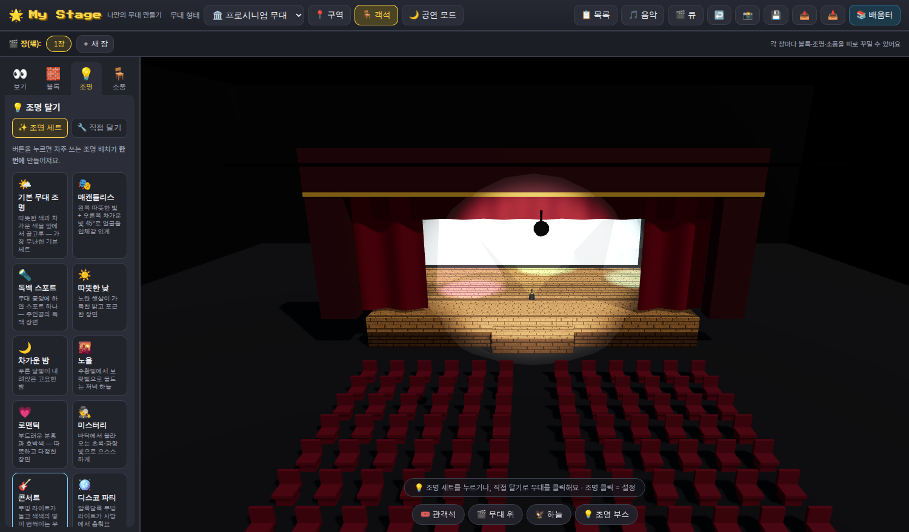
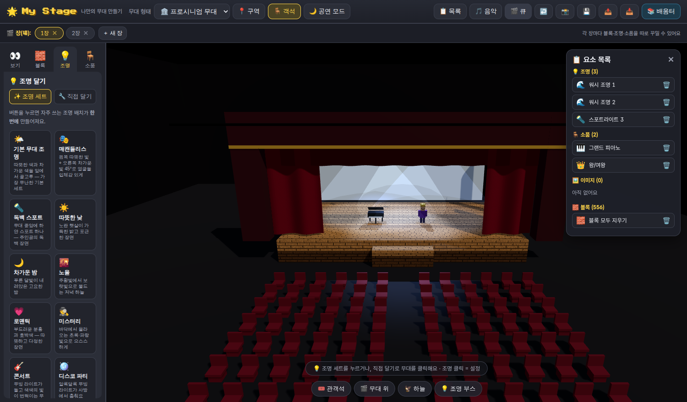
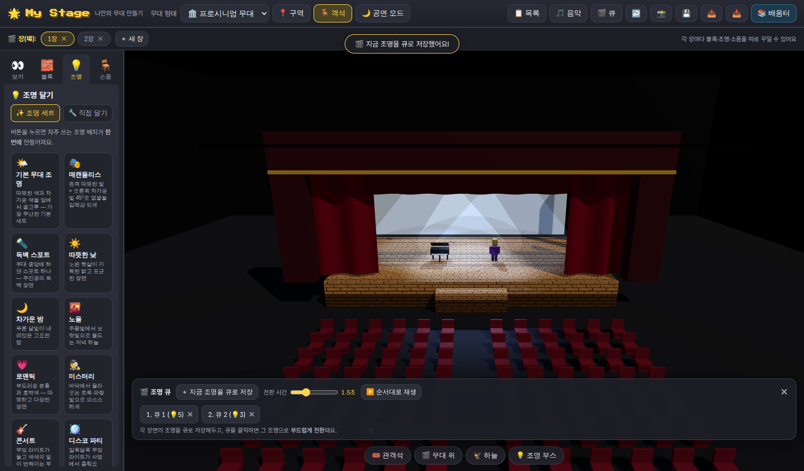
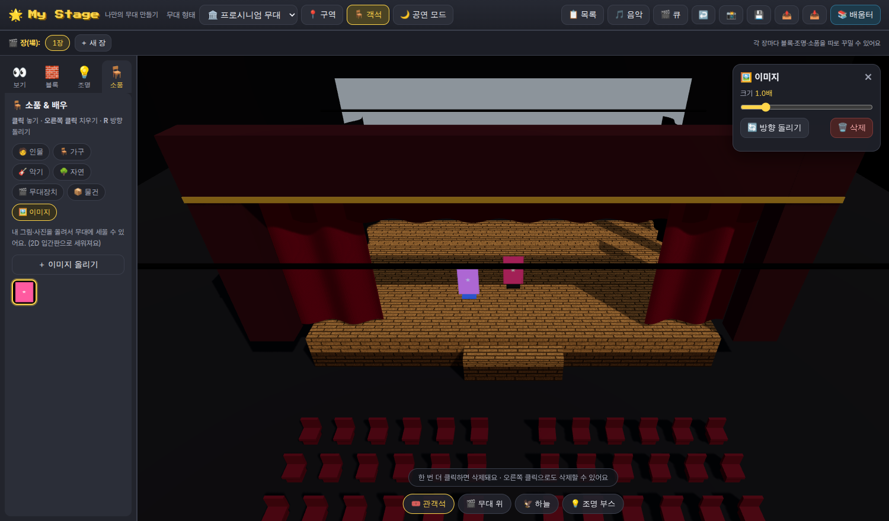

# 🌟 My Stage — 나만의 무대 만들기

어린이·청소년·선생님을 위한 **3D 무대 디자인 웹앱**입니다.
마인크래프트처럼 블록을 쌓고, 진짜 극장처럼 조명을 달아 나만의 무대를 완성해 보세요!


## ✨ 주요 기능

### 🏛️ 5가지 무대 형태
실제 극장 이론에 기반한 무대 형태 중에서 골라 시작해요.

| 무대 | 특징 |
|---|---|
| 🏛️ 프로시니엄 | 액자 틀(프로시니엄 아치) 너머로 보는 가장 익숙한 극장 — 커튼, 사이클로라마, 배튼 포함 |
| 📐 돌출 무대 | 객석 속으로 쑥! 관객이 3면을 둘러싸요 |
| ⭕ 원형 무대 | 360도 관객이 둘러싸는 아레나 |
| ⬛ 블랙박스 | 텅 빈 검은 방 — 상상력이 곧 무대 |
| 🌳 야외 무대 | 하늘이 천장인 축제 무대 |

### 🧱 마인크래프트식 블록 빌딩
- 픽셀 텍스처 블록 22종 — 나무 바닥, 커튼, 벽돌, 유리, LED(발광), 무지개 색 블록…
- 반블록(슬래브)으로 계단과 낮은 단 만들기
- 클릭으로 놓고, 오른쪽 클릭으로 부수고, Ctrl+Z로 되돌리기

### 💡 실제 광원 기반 조명 시스템
- **스포트라이트 · 팔로우 스팟 · 워시 · 플로어 라이트 · 무빙 라이트** 5종
- 실시간 그림자, 빛줄기(빔) 표현, 컬러 젤 8색 + 자유 색상, 밝기·빔 각도 조절
- **🌙 공연 모드**: 하우스 라이트를 끄고 내가 단 조명만으로 무대 감상
- 하우스 라이트(극장 전체 조명) 디머 슬라이더

### 🧍 소품 & 배우 (주제별 6가지 묶음, 50여 종)
- **인물** 배우·어린이·가수·무용수·왕/여왕·해설자·유령
- **가구** 의자·스툴·테이블·소파·벤치·침대·왕좌·책장·램프
- **악기** 피아노·드럼·기타·키보드·보면대·마이크·스피커·앰프
- **자연** 나무·소나무·화분·꽃·덤불·바위·버섯·호박·구름
- **무대장치** 연단·계단·기둥·아치·사다리·플랫폼·차단봉·이동식 커튼
- **물건** 상자·나무통·보물상자·랜턴·촛불·횃불·표지판·공·깃발·선물·시계·이젤

> 소품 3D 모델은 오픈소스 3D 에셋(GLTF 등)을 그대로 쓰지 않고, **외부 에셋 없이 코드로 생성**했습니다. 이렇게 하면 인터넷 없이도(오프라인) 동작하고, 저작권 걱정 없이 마음껏 배포할 수 있어요.

### 🖼️ 내 이미지 올리기 (2D 입간판)
그림·사진을 업로드하면 무대 위에 **입간판(standee)** 처럼 세워져요. 크기 조절·회전 가능. 배경 그림이나 캐릭터 컷아웃으로 활용하세요.

### 🎬 장(場) 관리 & 조명 큐
- **여러 장(scene)** 을 만들어 장면마다 블록·조명·소품·이미지를 따로 꾸며요.
- **조명 큐**: 지금 조명을 큐로 저장해두고, 큐를 클릭하면 그 조명으로 **부드럽게 전환**(페이드)돼요. 순서대로 자동 재생도 됩니다.

### ✨ 조명 세트 (초보자용 16종)
매캔들리스·독백 스포트·노을·차가운 밤·콘서트·디스코·판타지·무지개 등 자주 쓰는 조명 배치를 **버튼 한 번**으로 무대에 적용해요.

### 🎵 음악
음악 파일을 업로드하거나 **유튜브 링크**를 붙여넣어 배경 음악을 재생해요. (유튜브는 공식 임베드 플레이어로 재생합니다.)

### 📋 요소 목록
지금까지 추가한 조명·소품·이미지·블록을 목록으로 보고, 목록에서 바로 삭제할 수 있어요. 무대 위 요소를 **한 번 더 클릭**해도 삭제됩니다.

### 🧍 기본 소품 원조
배우(옷 색이 매번 바뀌어요!), 피아노, 드럼, 마이크, 스피커, 의자, 테이블, 화분, 나무

### 📚 무대 이론 배움터 (한국어)
- 무대의 종류와 역사 (프로시니엄부터 그리스 원형극장까지)
- 무대 구역 — 상수/하수, 업/다운스테이지, 9구역 (📍 **구역 보기**로 무대 바닥에 직접 표시!)
- 조명 이론 — 조명의 4가지 역할, 기구 종류, 가산혼합, 매캔들리스 방식
- 무대 용어 사전, 교실 활동 미션 카드

### 💾 저장과 공유
- 브라우저 자동 저장 + 이어서 만들기
- JSON 파일 내보내기/불러오기 (작품 제출·공유)
- 📸 스크린샷 저장

## 🖼️ 미리보기

| 프로시니엄 극장 | 야외 무대 |
|---|---|
|  |  |

| 조명 세트 & 장 관리 | 요소 목록 |
|---|---|
|  |  |

| 조명 큐 & 장(場) | 이미지 입간판 |
|---|---|
|  |  |

## 🚀 실행 방법

정적 웹앱이라 서버만 있으면 됩니다. (ES 모듈을 사용하므로 파일을 직접 열지 말고 로컬 서버로 실행하세요.)

```bash
# 방법 1: Python
python3 -m http.server 8000
# 방법 2: Node
npx serve .
```

브라우저에서 `http://localhost:8000` 접속!

> **GitHub Pages**로 배포하면 설치 없이 링크만으로 교실에서 바로 사용할 수 있어요.
> (저장소 Settings → Pages → 브랜치 선택)

Three.js가 `js/lib/`에 포함되어 있어 **인터넷 없이(오프라인)도 동작**합니다.

## 🎮 조작법

| 동작 | 방법 |
|---|---|
| 시점 돌리기 / 이동 / 확대 | 드래그 / 오른쪽 드래그 / 휠 |
| 블록·조명·소품 놓기 | 클릭 |
| 부수기 / 치우기 | 오른쪽 클릭 (또는 Shift+클릭) |
| 소품 방향 돌리기 | R |
| 모드 전환 | 1 보기 · 2 블록 · 3 조명 · 4 소품 |
| 되돌리기 | Ctrl+Z |

## 🛠️ 기술

- [Three.js](https://threejs.org/) r160 (로컬 포함, CDN 불필요)
- 순수 HTML/CSS/JavaScript — 빌드 과정 없음
- 픽셀 텍스처, 소품, 무대 프리셋 모두 코드로 생성 (외부 에셋 없음)
- 폰트: 타이틀은 [Press Start 2P](https://fonts.google.com/specimen/Press+Start+2P)(픽셀 아트), 본문은 [Pretendard GOV](https://github.com/orioncactus/pretendard) — 둘 다 로컬 포함(오프라인)
- 유튜브 배경 음악만 재생 시 인터넷이 필요해요 (공식 임베드 플레이어)
